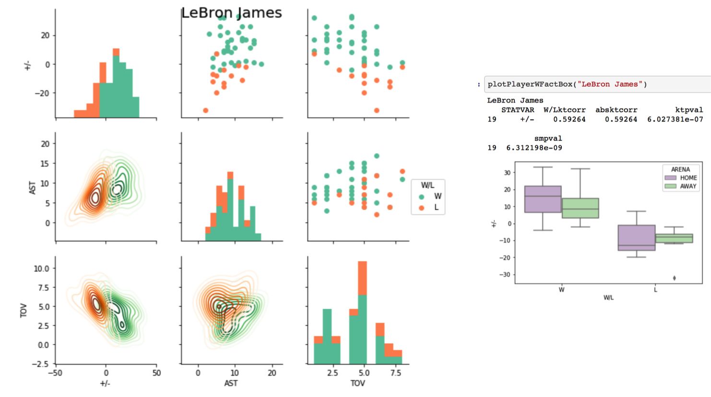

  

      <ul class="nav">
          <li><a href="bioinformatics1.html">prev</a></li>
          <li><a href="bioinformatics2.html">next</a></li>
      </ul>
  

[NBA Team and Player Analysis](https://github.com/bsharvey/NBA_Player_Team_Analysis), a methodology for analyzing NBA player and Team data.  This analysis assess Lebron James and the Cleveland Cavilers over the entire regular season. 

Figure 1: This chart shows an assist, turnover, "+/-" comparison over the season as it relates to wins and losses.
Figure 2: This chart diplays a "+/-" analysis to show box plots of wins and losses the mean and standard deviation along the regular season.

